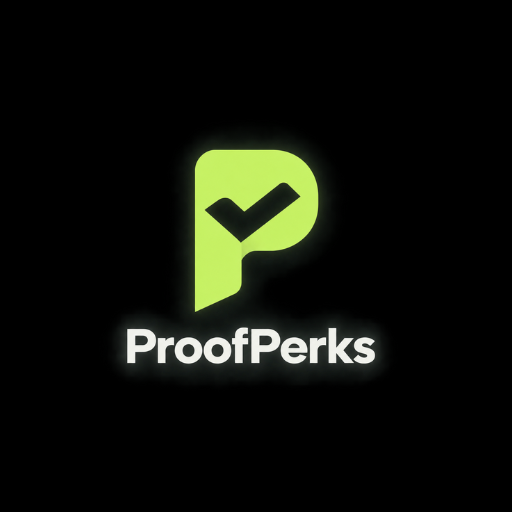

<!-- SPDX-License-Identifier: Apache-2.0 -->

<p align="center">
  
</p>

# ProofPerks

Private eligibility checks for Web3 community rewards, built with Midnight Compact.

[](https://github.com/SuryaXyz-art/Proofperks)

[Repository](https://github.com/SuryaXyz-art/Proofperks) · [Walkthrough](./docs/walkthrough.md) · [Contract](./contract/src/proofperks.compact) · [Pilot runbook](./docs/pilot-runbook.md) · [License](./LICENSE)

**Current stage: development prototype.** The contract compiles and the repository includes an organizer dashboard, testkit integration tests, and a reference CLI demo. A completed live Preprod deployment, successful end-to-end testkit run, and real pilot results are not claimed.

## Contents

- [Overview](#overview)
- [Why this matters now](#why-this-matters-now)
- [Who this is for](#who-this-is-for)
- [Status (Wave 1)](#status-wave-1)
- [What makes this different](#what-makes-this-different)
- [How a reward claim works](#how-a-reward-claim-works)
- [Privacy model](#privacy-model)
- [Trust boundary](#trust-boundary)
- [Privacy boundaries in practice](#privacy-boundaries-in-practice)
- [Architecture and technology](#architecture-and-technology)
- [Repository layout](#repository-layout)
- [How to run](#how-to-run)
- [Testing and measurement](#testing-and-measurement)
- [Wave 2 pilot materials](#wave-2-pilot-materials)
- [Roadmap](#roadmap)
- [Known limitations](#known-limitations)
- [Further reading](#further-reading)
- [License](#license)
- [Submission checklist](#akindomidnight-submission-checklist)

## Overview

ProofPerks is a privacy-preserving reward-claim system for Web3 community campaigns: an issuer can approve a contributor's evidence and points without putting the contributor's secret or raw points on the public ledger, while the contributor can later prove eligibility and claim once.

## Why this matters now

Web3 community campaigns commonly review contributions through screenshots, spreadsheets, and social activity, which can leave a lasting public link between a contributor's social identity, wallet, and contribution history. That creates doxxing risk and makes selective disclosure difficult: a contributor may be eligible for one reward but have no practical way to prove only that fact without exposing more history than they intended. ProofPerks addresses this narrow claims problem by keeping the evidence and credential inputs private while publishing only the ledger data needed to enforce campaign rules and one-time claims.

## Who this is for

- A campaign organizer running an ambassador, bounty, or community-contribution program.
- A contributor who wants to claim a reward without exposing their full contribution history.
- A protocol that needs an auditable claims process while keeping contribution evidence and credential inputs private.

The pilot materials describe a future supervised run with 3–5 contributors. The runbook and survey are templates/checklists; no real pilot results are claimed in this repository.

## Status (Wave 1)

Implemented in this repository:

- A single-campaign Compact contract with campaign rules, approved commitment storage, and a nullifier set.
- A private eligibility circuit that checks commitment membership and the campaign threshold.
- Nullifier-based double-claim prevention for each campaign and contributor secret pair.
- Issuer-controlled credential revocation using a domain-separated public revocation-nullifier set that does not expose the approved commitment being revoked.
- Issuer-mediated credential recovery that retires the old secret marker and issues a replacement under the same private contributor anchor.
- A separate fixed payout circuit that sends 1,000 base units of native Preprod test token (tNIGHT) to the recipient bound by a successful claim.
- A Node/TypeScript CLI demo with narratable happy-path, tampered-credential, and double-claim scenarios.
- A Midnight testkit-backed `node:test` integration suite for the same three scenarios; it imports the generated contract from `contract/managed`, never falls back to a JS mock, and labels real Compact/testkit timings when infrastructure is available.
- Preprod network configuration and a headless `deploy:preprod` command using Midnight.js.
- A minimal React organizer dashboard with wallet connection, session-only pending approvals, on-chain approval, public claim count, commitment root, and remaining-budget metrics.
- An organizer revoke control that submits issuer-signed future-claim revocations while keeping the target secret in session memory.

Not implemented yet:

- A completed live Preprod deployment from this workspace.
- A captured real-testkit proving-time report from this workspace; the latest run was explicitly skipped because Docker/testkit infrastructure is unavailable here.
- Contributor claim controls in the UI.
- Custom reward-token minting or treasury management beyond the fixed native-token payout.
- A generated claim-path indexer/private-state flow for the UI.

The Compact source compiles with `compact compile`, including full ZK assets when run without `--skip-zk`. The integration tests exercise the generated artifact through Midnight testkit when its node, indexer, wallet, and proof-server infrastructure is available. The explicit `reference` mode remains the runnable Wave 1 CLI fallback; its timings are not Compact proving times.

## What makes this different

The naive alternative is a public spreadsheet or an on-chain record that links a contributor, wallet, evidence, points, and full claim history. ProofPerks separates those concerns:

- The issuer approves a contribution by recording a commitment hash rather than raw evidence, secret, or points.
- The commitment is stored as a public Merkle-tree leaf; a private claim proves Merkle membership and recomputes the credential from private witnesses.
- The circuit checks the public campaign threshold without publishing the raw points.
- A public claim nullifier prevents reuse of the same credential, while a separate contributor marker prevents an old and replacement secret from claiming twice after recovery.
- Issuer-mediated revocation publishes an opaque, domain-separated marker, and recovery retires the old secret marker before inserting a replacement commitment.

This is a focused implementation of private eligibility and replay prevention. It does not verify real-world contribution completion, replace issuer judgment, or claim novelty relative to other projects whose internals are not independently verifiable here.

## How a reward claim works

1. **Configure one campaign.** Deployment sets the campaign ID, minimum points, active flag, issuer key, and reward-budget cap.
2. **Review work privately.** The issuer reviews contribution evidence outside the contract and decides which points to approve.
3. **Approve a credential.** `approve_contribution` checks the issuer-secret witness, hashes the campaign ID, private contributor anchor, secret, and points with a domain separator, and inserts the resulting commitment into the public Merkle tree. A commitment is a hash representing those inputs, not the raw contribution record.
4. **Prove eligibility and claim once.** `claim_reward` recomputes that commitment, binds it to a Merkle path, checks the tree root and points threshold, and rejects revoked or already-used credentials. It also checks a contributor-level marker to prevent a replacement secret from claiming again.
5. **Record the claim.** A successful claim records public one-time markers, called nullifiers, and binds a public payout recipient. The claim count comes from the used-nullifier set.
6. **Request the separate payout.** `payout_reward` checks the recorded claim, recipient, payment status, available token balance, and budget. It sends exactly 1,000 native test-token base units and records the payment. A successful claim does not automatically mean a payout has completed.

### Revocation and recovery

- **Revocation:** the issuer records a domain-separated marker derived from the credential secret. Future claims check that marker. The original approved leaf remains in the tree; revocation does not delete it or reverse an earlier claim.
- **Recovery:** the issuer retires the old secret marker and inserts a replacement commitment in one circuit call. The old and new credential must use the **same private contributor anchor**, so rotating the secret does not reset claim eligibility.
- **Recovery prerequisites:** the issuer must supply the correct old secret and retained anchor. This is an administrative re-issuance process, not automatic recovery of a secret nobody retains.
- **Capacity:** the depth-5 commitment tree holds 32 entries. Both initial approvals and replacement commitments consume entries.

These are mechanisms present in the [contract source](./contract/src/proofperks.compact), not a claim that their complete wallet/testnet lifecycle has already been demonstrated.

## Privacy model

| Visibility | Data | What it means |
| --- | --- | --- |
| Private | Contribution evidence | The issuer's source evidence is not stored raw by the contract. |
| Private | Contributor secret | Used locally to derive the approved commitment and claim nullifier. |
| Private | Stable contributor anchor | Rotates independently from the secret and prevents an old/new recovery pair from claiming twice. |
| Private | Raw points | Used as a witness to recompute the commitment and check the threshold. |
| Public | Campaign rules | Campaign ID, threshold, and active flag are public ledger configuration. |
| Public | Commitment tree and root | Only approved commitment hashes and the resulting Merkle root are public. |
| Public | Nullifiers and revocation markers | Used claim nullifiers and opaque revocation markers are public for replay and future-claim checks; revocation markers are domain-separated from commitment hashes and do not reveal the revoked commitment by themselves. |
| Public | Claim count | Derived from the public nullifier set size. |
| Shared by choice | Audit evidence | An issuer or contributor may share supporting evidence voluntarily; the contract does not require it to be public. |

## Trust boundary

The issuer still decides whether a contribution deserves approval. The circuit only proves that an issuer-approved credential is in the commitment tree, meets the campaign threshold, and has not been claimed before. It does not verify that the contributor really completed a real-world task.

## Privacy boundaries in practice

“Private” means the raw evidence, points, and secret are not published as raw ledger fields; it does not mean they are hidden from the issuer who reviews or approves them. Approval uses issuer-side private witnesses, so handling and exchanging those inputs remains part of the application's trust boundary.

The privacy table is not an anonymity guarantee:

- The recipient address is public. Payout uses an unshielded token transfer; recipient, amount, and transaction activity should not be described as hidden.
- The current `claim_reward` source explicitly uses `disclose(path)` for its Merkle path. Do not assume the identity of the claimed commitment is hidden from the public transaction data.
- The revocation marker is disclosed during the claim check as well as on revocation. Domain separation avoids publishing the credential secret, but does not by itself guarantee that claim and revocation activity cannot be correlated.
- Organizer inputs stay in session memory in the current UI. This does not protect against a compromised browser, screenshots, clipboard/history exposure, or voluntary evidence sharing.
- Issuer authorization in the circuit proves knowledge of an issuer secret matching the configured public key. Wallet transaction signing is a separate step; the current circuit does not establish a stronger wallet-account identity binding.

See [the contract](./contract/src/proofperks.compact) and [wallet integration](./ui/src/midnight.js) for these boundaries. Security review is still required.

## Architecture and technology

| Component | Technology | Responsibility |
| --- | --- | --- |
| [On-chain rules](./contract/src/proofperks.compact) | Midnight Compact | Campaign configuration, approved commitments, eligibility checks, revocation, recovery, and separate payout. |
| [Contract package](./contract/src/index.ts) and [witnesses](./contract/src/witnesses.ts) | TypeScript, Compact runtime | Expose the generated contract and supply application-side private inputs. |
| [Integration tests](./contract/test/proofperks.test.mjs) | Node.js built-in test runner, Midnight testkit | Exercise the generated contract through deployment and transaction calls when infrastructure is configured. |
| [CLI demo](./cli/demo.ts) | Node.js / TypeScript | Narrate three claim scenarios; use an explicit reference simulation or a supplied live deployment adapter. |
| [Preprod deployment](./cli/src/preprod-deploy.ts) | Midnight.js, wallet SDKs | Configure providers and deploy using a funded headless wallet. |
| [Organizer dashboard](./ui/src/main.jsx) | React, Vite, Midnight wallet connector | Maintain session-only approval inputs, submit organizer actions, and display public aggregates. |
| [Pilot tooling](./cli/export-pilot-metrics.mjs) | Node.js | Export restricted aggregate event metrics; reference load simulation is separate from real proving. |

The root is an npm workspace with `contract`, `cli`, and `ui` packages. The project declares Node.js 22 or newer.

### Public budget versus available funds

The dashboard's remaining budget is the contract's public accounting cap. It is not proof that the contract holds enough tokens. A payout requires **both** remaining budget and an independently funded contract token balance.

## Repository layout

```text
proofperks/
├── contract/
│   ├── src/
│   │   ├── proofperks.compact      # Contract source
│   │   ├── index.ts               # Contract package exports
│   │   ├── witnesses.ts           # Private-input callbacks
│   │   └── managed/proofperks/    # Generated app/package artifacts (ignored)
│   ├── managed/                  # Generated integration-test artifacts (ignored)
│   ├── scripts/                  # Compilation and artifact-copy helpers
│   └── test/proofperks.test.mjs   # Three testkit integration scenarios
├── cli/
│   ├── demo.ts                   # Narratable reference/live-adapter demo
│   ├── src/                      # Compile, deploy, and provider helpers
│   ├── load-test.mjs             # Reference concurrency simulation
│   └── export-pilot-metrics.mjs   # Restricted aggregate metrics export
├── ui/                           # React organizer dashboard
├── docs/                         # Walkthrough, pilot materials, and README image
├── README.md
├── package.json                  # Workspace commands
└── LICENSE                       # Apache-2.0
```

The two generated-output directories currently serve different consumers. Generate both when preparing the app and the integration tests; neither is supplied by a fresh Git clone.

## How to run

### 1. Prerequisites and installation

Use Node.js 22 or newer and npm. Full contract builds require Compact; on Windows, install it inside WSL2 Ubuntu. Live tests and deployment additionally need compatible Midnight node/indexer/wallet/proof-server infrastructure.

Clone the repository and install dependencies from the repository root:

```powershell
git clone https://github.com/SuryaXyz-art/Proofperks.git proofperks
cd proofperks
npm install
```

If Compact is not installed, follow the [Midnight installation guide](https://docs.midnight.network/getting-started/installation) from WSL:

```bash
curl --proto '=https' --tlsv1.2 -LsSf https://github.com/midnightntwrk/compact/releases/latest/download/compact-installer.sh | sh
compact update 0.31.1
```

### 2. Compile the contract and application package

From the repository root:

```powershell
npm run compile
```

This workspace command generates `contract/src/managed/proofperks` and builds the generated TypeScript wrapper as the contract package. On Windows, the compile script automatically invokes Compact through WSL because the compiler is not natively supported there. The integration suite imports a different location, `contract/managed`. Generate that location too, using the following command **inside WSL Ubuntu, from the cloned repository root**:

```bash
compact compile contract/src/proofperks.compact contract/managed
```

Do not use `--skip-zk` for a real proof run: it omits the full proving/verifying assets. Recompile both locations after changing the Compact source.

### 3. Run the integration tests

The tests use Node's built-in runner and Midnight testkit. Start Docker Desktop for a local undeployed environment, or set `MN_TEST_ENVIRONMENT` for a configured remote environment. Docker availability alone is not sufficient: configure the testkit's local service/Compose setup or its supported remote environment first. This repository does not include a local Compose configuration.

```powershell
npm test
```

If testkit infrastructure is unavailable, the three integration tests are explicitly marked `SKIP`; they never fall back to a JavaScript mock. In a real testkit run, claim lines are labeled `REAL COMPACT/TESTKIT` and measure proof generation plus transaction finalization. This checkout's latest run produced no such timings because Docker was unavailable.

### 4. Run the local CLI demonstration

For the runnable, local reference demo fallback:

```powershell
$env:PROOFPERKS_DEMO_MODE="reference"
$env:PROOFPERKS_NETWORK="local"
npm run demo --workspace @proofperks/cli
```

This path simulates the three scenarios locally. It does not submit blockchain transactions, require a deployed contract, or provide ZK proving-time measurements. The root `npm run demo` script delegates to the same CLI workspace.

### 5. Prepare a Preprod deployment — not yet executed here

These commands document the implemented deployment path, not a completed deployment. Keep wallet seeds and private-state passwords out of commits, recordings, and shared terminal logs.

The Preprod deployment requires a funded headless issuer wallet and local proof server. Start the proof server in one terminal:

```powershell
docker run -p 6300:6300 midnightntwrk/proof-server:8.1.0 midnight-proof-server -v
```

Leave it running. In a second PowerShell terminal, from the repository root:

```powershell
$env:PROOFPERKS_WALLET_SEED="<32-byte-hex-seed>"
$env:PROOFPERKS_ISSUER_PUBLIC_KEY="<32-byte-hex-key>"
$env:PROOFPERKS_PRIVATE_STATE_PASSWORD="<strong-local-password>"
npm run deploy:preprod
```

The wallet must have Preprod tNIGHT and DUST available. The command prints the deployed contract address; keep it for the UI configuration.

The deployment account or another treasury must also fund the contract with native Preprod test token (tNIGHT). `PROOFPERKS_REWARD_BUDGET` sets the public campaign budget cap at deployment; each successful claim can then call `payout_reward` to send exactly 1,000 base units to the recipient address bound during `claim_reward`. Payout is intentionally a second transaction so its failure cannot roll back or bypass the privacy checks.

### 6. Build and run the organizer dashboard

To compile and build the UI:

```powershell
npm run build:ui
```

A build is not an end-to-end wallet validation. To run the Preprod UI against that contract:

```powershell
$env:VITE_PROOFPERKS_CONTRACT_ADDRESS="<deployed-contract-address>"
$env:VITE_PROOFPERKS_ISSUER_PUBLIC_KEY="<same-issuer-public-key>"
npm run dev --workspace @proofperks/ui
```

Open the Vite URL in Chrome with Midnight Lace installed, set to Preprod, and click **Connect wallet**. Enter the contract address, issuer public key, and issuer secret; add a pending credential, then click **Approve on-chain**. The approval transaction is balanced and submitted through the connected wallet API. The dashboard reads only public ledger aggregates, while issuer/contributor secrets and raw points stay in React memory for the current session and are never written to `localStorage`, `sessionStorage`, IndexedDB, or the ledger.

### 7. Optional: supply a live CLI adapter

For a custom live CLI scenario runner, provide a deployment adapter that exports `createProofPerksDeployment`:

```powershell
$env:PROOFPERKS_DEMO_MODE="live"
$env:PROOFPERKS_NETWORK="local" # or testnet
$env:PROOFPERKS_DEMO_ADAPTER="C:\path\to\deployment-adapter.mjs"
npm run demo --workspace @proofperks/cli
```

The live adapter is responsible for the generated Compact contract, wallet, providers, proof server, deployment, and ledger snapshots. See [cli/demo.ts](./cli/demo.ts) for its required interface and output contract.

PowerShell examples use `$env:NAME="value"`. In a Bash terminal, use `export NAME="value"` for the same environment settings. The direct Compact command above must run in the environment where Compact is installed.

## Testing and measurement

The [integration suite](./contract/test/proofperks.test.mjs) imports `contract/managed/contract/index.js` and wires the generated contract into Midnight testkit. It does not replace the contract with a JavaScript reference model.

| Scenario | Intended check |
| --- | --- |
| Happy path | Approve a qualifying contribution, claim successfully, and observe an additional used nullifier. |
| Tampered credential | Change the claimed points, reject the attempted claim, and leave the nullifier set unchanged. |
| Double claim | Accept the first claim and reject the second without adding another nullifier. |

**Execution status:** the latest documented run skipped all three integration tests because Docker/testkit infrastructure was unavailable. A skipped test is not a passing test. No successful live integration run or numerical real-proving benchmark is reported here.

### Read timing output correctly

- `REAL COMPACT/TESTKIT` is the integration runner's label. Its timer surrounds the complete contract call, including proof generation and transaction finalization on successful calls; it is **not isolated prover time**.
- A rejected call can fail during local witness preparation, before a proof is generated. Its elapsed time is not necessarily proving or verification time.
- The current negative tests accept a rejected call and check unchanged state; they do not isolate every possible rejection cause. The tampered case can fail because no Merkle path is supplied for the changed commitment.
- Reference CLI and load-runner durations measure an in-process simulation. Do not present them as Compact proof-server results or real network race-condition measurements.
- The three integration scenarios do not constitute complete payout, revocation, recovery, or production-security coverage.

For a submission report, keep simulation results, successful live call durations, rejected-attempt durations, and any future isolated prover measurements in separate categories.

## Wave 2 pilot materials

Use [docs/pilot-runbook.md](./docs/pilot-runbook.md) to onboard 3–5 contributors, run the supervised claim flow, and capture only safe aggregate events. The short feedback form is in [docs/pilot-survey.md](./docs/pilot-survey.md). Export the Wave 2 report metrics with:

```powershell
npm run pilot:export -- --input .\pilot-events.jsonl --output .\pilot-metrics.json
```

Run the deterministic reference load simulation with up to 32 concurrent claims (the current depth-5 tree capacity):

```powershell
$env:PROOFPERKS_LOAD_N="32"
npm run pilot:load
npm run pilot:export -- --input .\pilot-events.jsonl --output .\pilot-metrics.json
```

The load runner reports valid-batch failure rate and proving-time average/p95 separately from an intentional same-nullifier race probe. It is not a live proof-server benchmark.

The exporter accepts only `type`, `status`, `provingTimeMs`, and `failureCategory`; it rejects extra fields to help prevent accidental export of participant data.

## Roadmap

The roadmap below separates work that is already scaffolded from work that still requires execution or implementation.

### Wave 2 — run and complete the pilotable flow

- Execute the existing Preprod deployment script with a funded wallet, DUST, proof server, and reward pool; no live deployment has been completed from this workspace.
- Run the supervised 3–5 contributor pilot described in [docs/pilot-runbook.md](./docs/pilot-runbook.md) and collect feedback using [docs/pilot-survey.md](./docs/pilot-survey.md); the materials exist, but the pilot has not been run.
- Add contributor claim controls to the React UI. The current UI is an organizer dashboard and does not yet provide a contributor claim screen.
- Add the claim-path indexer/private-state flow needed for a contributor-facing claim experience.
- Use the existing anonymized exporter and reference load runner to produce reportable aggregate metrics, then replace reference timings with live testkit measurements when test infrastructure is available.
- Move pending approval intake and organizer audit history beyond the current session-only queue if the pilot requires durable operations.

### Wave 3 — production hardening and broader scope

- Extend the current single-campaign model to support multiple campaigns.
- Add custom reward-token and treasury management beyond the fixed native-token payout.
- Decide and implement any desired policy for claims or payouts after revocation; current revocation is future-facing and not retroactive.
- Strengthen issuer wallet/account authorization if the application needs a stronger identity binding than the current issuer-secret witness plus configured issuer public key.
- Complete security review before production use.

## Known limitations

- Native Windows is not supported by Compact; use WSL for the compiler and Docker Desktop for the proof server.
- A live Preprod deployment needs a funded wallet, DUST, Lace or headless wallet configuration, the local proof server, and a separately funded reward pool.
- The organizer dashboard’s pending queue is intentionally session-only and has no backend/indexer integration; it is not a durable workflow for receiving approval requests.
- The runnable reference demo is an in-process harness, not a blockchain transaction and not a measurement of real ZK proof-server time.
- A live custom CLI demo still needs a deployment adapter and configured local/testnet infrastructure.
- Only one campaign is modeled.
- Issuer approval is trusted and centralized; real-world contribution completion is outside the circuit's trust model.
- Revocation is future-facing only: revoking before a claim blocks the claim, but revoking after a nullifier is recorded does not undo that claim or reverse a payout. This is a known limitation.
- Recovery depends on the issuer and contributor retaining or securely exchanging the stable private contributor anchor; losing that anchor requires a new identity/credential process outside this contract.
- Recovery is intentionally issuer-mediated: the recovery circuit checks the old secret marker and anchor binding, but does not independently prove old commitment membership; the issuer must supply the correct old secret.
- Organizer audit history and full wallet-connected claim UX remain out of scope for this Wave 1 implementation.
- The contract and demo need security review before production use.

## Further reading

| Document or source | Start here when you want to… |
| --- | --- |
| [Project walkthrough](./docs/walkthrough.md) | Follow the detailed demonstration and project scope. |
| [Pilot runbook](./docs/pilot-runbook.md) | Prepare the supervised 3–5 contributor pilot and its prerequisites. |
| [Pilot survey](./docs/pilot-survey.md) | Collect claim-flow feedback without requesting identifying information. |
| [Example pilot events](./docs/pilot-events.example.jsonl) | Understand the safe event schema; example values are not pilot results. |
| [Preprod configuration](./cli/src/preprod-config.mjs) | Inspect the endpoints and proof-server setting used by the deployment helper. |
| [CLI adapter interface](./cli/demo.ts) | Connect the narrated demo to a configured live deployment. |

The pilot documents describe planned execution. They are not evidence of completed onboarding, user feedback, or measured adoption.

## License

Apache-2.0. See [LICENSE](./LICENSE).

## AKINDO/Midnight submission checklist

Leave these items unchecked until they are manually confirmed:

- [x] Public GitHub repository: [https://github.com/SuryaXyz-art/Proofperks](https://github.com/SuryaXyz-art/Proofperks)
- [ ] This README
- [ ] Pitch deck
- [ ] Demo video
- [ ] Wave progress description
- [ ] `midnightntwrk` repository topic/label
- [ ] Apache-2.0 license applied to the Midnight code
